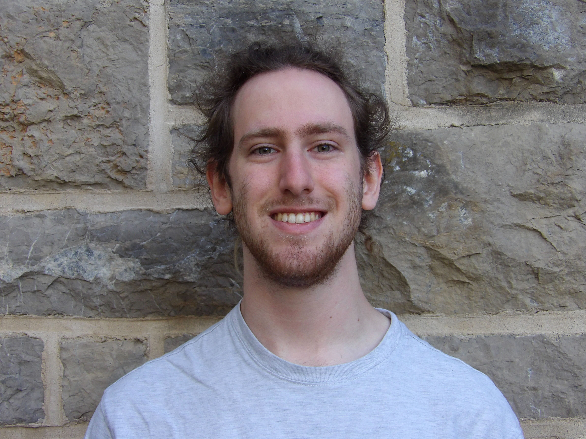

:::: {style="display: flex; justify-content: space-between; column-gap: 50px; "}

::: {style="border-right: 1px solid grey; padding-right: 20px; align-self: stretch"}

{width=6in}

:::

::: {style="flex-grow: 1"}
# Bio

Welcome to my page! I am currently a masters student in Biostatistics at Columbia University. Right now, I'm interested in functional data analysis methods in health problems and disease forecasting using Bayesian methods. Outside of work, I like hiking, rock climbing, listening to / making music, and chess.

:::

::::